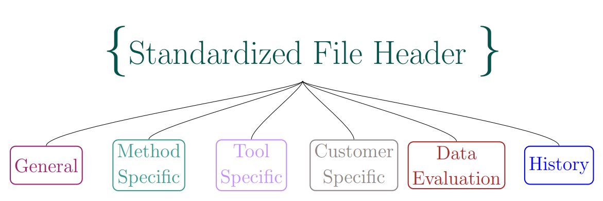
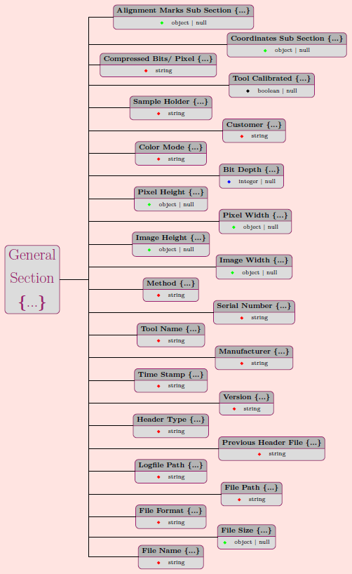
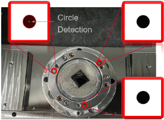
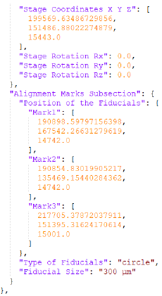

# Standardized Failure Analysis Metadata Header Documentation

In semiconductor failure analysis (FA), multiple analysis steps using different technologies are typically carried out to identify the causal failure. In order to enable a higher degree of automation, the machines used for the different analysis steps must be able to communicate with each other through a standardized interface. The goal of the standardized metadata header is to provide such an interface by providing a standard schema for the storage of metadata associated with analysis images or other measurement data types.

Each image created during a failure analysis should be accompanied by a JSON metadata header that adheres to the same schema. This will allow failure analysis software systems to easily incorporate the metadata in their databases and exchange these metadata between different analysis machines, thereby enabling increased automation as well as laying the ground for ML-based analysis of FA data.

This documentation describes the structure of the JSON Header and how the different sections shall be used. Furthermore, usage examples of the JSON Header are sketched out for better understanding.

The Header has a federal structure and contains standardized data fields/labels and non-standardized areas for multi-purpose data fields.

**Contents**

- [Header Sections](#header-sections)
  - [Customer](#customer)
  - [General](#general)
  - [Method](#method)
  - [Tool](#tool)
  - [Data Evaluation](#data-evaluation)
- [Manufacturer Information](#manufacturer-information)
- [JSON Header Workflow](#json-header-workflow)

## Header Sections

This section describes the different sections that make up the JSON Header and what they are used for.
In the future, further sections may be added. The modular schemas of the header allow extension and adding of new sections.
The following image gives an overview of the overall structure of the header:

The different sections are generated based on seperate JSON-Schema files (Each section has an own schema file). This allows easy interchangeability of new versions for different sub sections and also easy customization (e.g. Infineon and Bosch may have different CustomerSection-Schema Files without affecting the other sections

### Customer

The customer section contains information that is specific to the customer. Here, customer typically refers to the analysis lab in which the JSON Header is used. The information contained in this section can be fully customized for the respective user/organization/company. Typical information would be internal sample IDs, order numbers or other information that is useful for processing of the sample.

### General

The general section contains all general information about the image to which the JSON Header relates. For example, this includes things like

- file format
- file size
- image height and width
- bit depth
- color mode
- file name
- ...

The general section with its data fields/labels is illustrated in the following graphic. The illustrations for the other sections can be found in the detailed report: **Link to Markos Report**

Furthermore, the general section contains a **coordinates sub section**, which should be used to store all coordinates needed to determine the position of a part on a standard holder. This includes stage coordinate marks, stage rotation and general stage coordinate system information. Transformed coordinates of marked objects on the image can also be saved in this section.
This coordinate sub section also contains the coordinates of the three alignment marks of the standardized sample holder. The following tools are thus able to align their coordinate system according to the alignment marks.
The following images show the universal sample holder with its alignment marks (left) and an examplary coordinate sub section of the header:

 

### Method

The method section contains information that is specific for a certain analysis method, such as scanning electron microscopy (SEM), focused ion beam (FIB) or X-ray. For each method, the method section schema must be extended with a new object in the method section. The exemplary structure is as follows:

- methodspecific
  - SEM
    - accelerating voltage
    - decelerating voltage
    - ...
  - FIB
  - Xray
  - <new method>

Existing Meta-Data should be mapped to the data fields/labels in the respective method section.

_Hint_: Existing meta-data with no matching data fields/labels could be stored in the private/tool specific section.

_Hint_: Each method has its own schema file. The schema files can be merged/combined into one global method specific schema file, if desired. Otherwise, within the header creation software, the respective schema needs to be selected.

### Tool

The tool section contains all information related to a specific tool such as a specific version of a microscope. The structure similar to the method section: for each tool, a new object must be inserted in the tool section schema. The tool vendors are responsible for filling the tool specific section. The section must follow the overall JSON schema rules, but the individual data fields/labels can be determined by the tool vendor. This allows a high degree of freedom to the individual tool vendor.
_Hint:_ As optional step, the tool vendor can provide its JSON schema file of the tool specific section to the customer, to enable and simplify the further usage of the tool specific meta-data.

### Data Evaluation

The data evaluation contains information about measurement evaluation. This includes, for example, points and regions of interests (POI and ROI, respectively) that have been marked on the associated image. There exists a **poi** and a **roi** object in the **dataevaluation** schema, which can be used accordingly. A POI is simply described by a name and x- and y-coordinates. ROIs can be defined in the **roi** section as either polygons or polylines and are defined by a name, multiple points and additionally fill and stroke color as well as stroke width. Polygons require the additional area attribute.

## Manufacturer Information

This section contains information that is relevant for equipment manufacturers that want to integrate the JSON Header into their equipment.

In order to facilitate generation and usage of the FA4.0 JSON Header, any equipment machine must be able to both read and write JSON files that adhere to the FA4.0 JSON Header schema.

### Read JSON Header Files

The reading of JSON header files is necessary for several reasons. First, it allows to transfer information, stored in the JSON Header, between differnt tools. This could be POIs, ROIs and the location on the sample holder, for example. Moreover, in order for the tool to write a JSON file itself, it usually requires customer-specific information such as order or sample IDs that can be read via the JSON header. This information is crucial for identifying the resulting image and storing at properly in a database. Therefore, a tool user should be able to load a JSON file via the accompanying tool software.

Coordinate-related information in the JSON Header, such as stage coordinates, must also be aligned to the local tool coordinate system in order to allow transfer of POIs/ROIs between tools. If the tool should facilitate a sample holder-based workflow to allow for easy transfer of coordinates between tools, it must provide functionality to read the sample holder reference points and align the coordinate system accordingly with the coordinates defined in the JSON Header.

### Write JSON Header Files

Any JSON Header files that are created by the tool must adhere to a specified version of the FA4.0 JSON Header schema. Depending on the tool, the information will most likely be written to the sections General, Method and Tool. When saving an image after loading a JSON Header file, a new JSON Header file should the be automatically stored. The name of the JSON file must be identical to the image file except for the file extension. For example:

- my_example_image.png
- my_example_image.json

## JSON Header Workflow

The Standardized FA JSON Header is used for image meta data storage and can be used as a transfer file to exchange the meta data between different tools in a workflow. In the following an exemplary workflow is illustrated between a scanning acoustic microscope (tool A) and focused ion beam (tool B) using the JSON Header together with the Universal Sample Holder: 

- A Flip Chip (such as one illustrated in the images below) is analyzed after a thermal stress test which induces delaminations between the solder bumps and the interconnection layer of the die. 
 

The JSON Header can be used for general image metadata storage and to transfer this metadata between different tools. An exemplary workflow could look like the following:

- Create initial JSON file from database
  - This initial JSON file would hold no image information but only customer-specific information such as order or part IDs
- Load initial JSON file to tool A
- Create Image with tool A
- Save JSON Header for image with tool A
  - This JSON header would contain information about the image as well as any image or sample holder related coordinates that were used while taking the image
- Optional: Upload JSON Header and Image to database
- Load JSON header with tool B
  - The JSON header to be loaded could either be newly created from the database (if information was uploaded), or the file that was created in the previous steps could be used directly
- Create image with tool B with the help of positional information stored in JSON Header
- Save new JSON Header with tool B

In this workflow, a set of certain POIs could be marked in the image taken with tool A and then be transferred to tool B, which can then take pictures of the same POIs based on the coordinates. This requires storing of all coordinate-related information and correct transformation between coordinate systems, if necessary. In case of using a sample holder, this workflow is greatly simplified as the coordinate system of the sample holder can be used.
